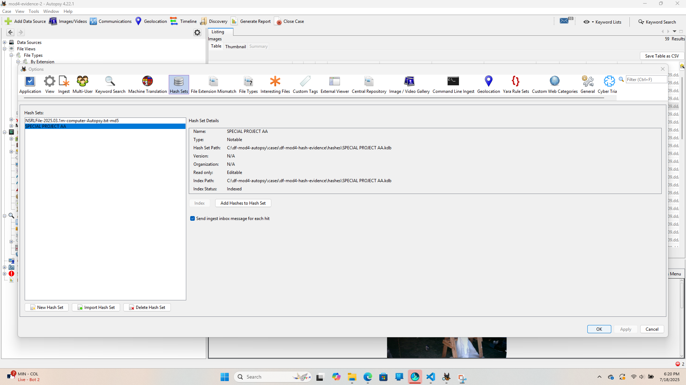

# Module 4 - Recovering Hidden Evidence
Cole Greashaber
Date: July 17th 2025

## Objective
This repo has my notes, will include screenshots, and have some scripts for PowerShell included as well.

## Exercise 1 

I imported the NSRL hash set (NSRLFile-2025.03.1m-computer-Autopsy.txt-md5) into Autopsy. This hash set contains known files (e.g., standard system files, common software) that are not normally a part forensic investigations.

![Snip Method] (images/ autopsy screenshot 1.png)

## Exercise 2

I created a hash database  Special Project AA which contains tagged from the data source InChap09.dd. These files were correlated with “Special Project A” and marked as notable. This allows investigators to recognize these files in future cases by comparing hash values.

## Exercise 3

Exercise 3: Hex Editor – Match File Remnants

My Word document (mydoc.docx) hashed using PowerShell with SHA-256.

Jeffersonian quotes.doc loaded into the HexEd.it hex editor and hashed with SHA-256.

We use SHA-256 to verify the integrity of our data and match partial remnants of deleted files. This is a good tool for digital forensics to be able to verify needed data.

![Snip Method] (unages/ autopsy screenshot 3.png)

## Exercise 4

On this exercise I used CyberChef to encode and decode a txt file

I used a txt file with the txt: I am ready for this

Using the command: Vigenere Encode 

My text was changed to : L fu ihflp itz kkna

I used the command: Vigenere Decode

The text channged to : I am ready for this

![Snip Method] (usages/ autopsy screenshot 4.png)

